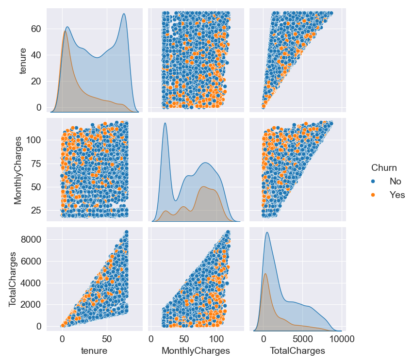

# **PREDICTING CUSTOMER CHURN IN THE TELECOM INDUSTRY**

## **Contents**

- [**PREDICTING CUSTOMER CHURN IN THE TELECOM INDUSTRY**](#predicting-customer-churn-in-the-telecom-industry)
  - [**Contents**](#contents)
  - [**Project Description**](#project-description)
  - [**Introduction**](#introduction)
  - [**Data Collection**](#data-collection)
  - [**Data Exploration and Visualization**](#data-exploration-and-visualization)
    - [**Distribution of `Churn`**](#distribution-of-churn)
    - [**Distribution of `tenure`**](#distribution-of-tenure)
    - [**Distribution of `MonthlyCharges`**](#distribution-of-monthlycharges)
    - [**Pairplot with Summary Statistics**](#pairplot-with-summary-statistics)
    - [**Examining the presence out outliers**](#examining-the-presence-out-outliers)
  - [**Data Preprocessing**](#data-preprocessing)
  - [**Feature Engineering**](#feature-engineering)
    - [**Selection of Relevant Features for Modeling**](#selection-of-relevant-features-for-modeling)
  - [**Model Development and Evaluation**](#model-development-and-evaluation)
    - [**Selection of Machine Learning Algorithms for Churn Prediction**](#selection-of-machine-learning-algorithms-for-churn-prediction)
    - [**Training and Evaluating Models**](#training-and-evaluating-models)
    - [**Comparison of Model Performance and Selection of the Best Model**](#comparison-of-model-performance-and-selection-of-the-best-model)
    - [**Hyperparameter Tuning**](#hyperparameter-tuning)
    - [**Final Model Evaluation**](#final-model-evaluation)
  - [**Model Interpretation**](#model-interpretation)
    - [**Feature Importance Analysis**](#feature-importance-analysis)
  - [**Predictions**](#predictions)
  - [**Conclusion**](#conclusion)

## **Project Description**
In the highly competitive telecom industry, retaining customers is critical to maintaining market share and profitability. Customer churn, the rate at which customers discontinue their service, poses a significant challenge for telecom companies. Predicting churn allows companies to proactively address customer concerns and improve retention strategies. This project leverages machine learning techniques to predict customer churn based on various factors, including customer demographics, service usage patterns, and account information.

## **Introduction**

The telecom industry is highly competitive, with companies continuously striving to attract and retain customers. Customer retention is crucial as it is often more cost-effective to maintain existing customers than to acquire new ones. Loyal customers also contribute to a stable revenue stream and positive brand reputation.

Customer churn refers to the loss of clients or subscribers. In the telecom sector, churn can result from factors like poor service quality, better offers from competitors, or changes in customer preferences. High churn rates can lead to significant revenue loss and increased costs associated with acquiring new customers. Predicting churn allows companies to address issues proactively, improving customer satisfaction and reducing turnover.

## **Data Collection**

The dataset used for this project was obtained from Kaggle, specifically from the Telco Customer Churn dataset available at [Kaggle: Telco Customer Churn](https://www.kaggle.com/datasets/blastchar/telco-customer-churn). The dataset consist of 7043 entries with 21 features. This dataset includes various attributes related to customer demographic information, subscription details, service usage, billing informatio, and churn status. The key attributes in the dataset are as follows:

- **customerID:** A unique ID that identifies each customer

- **gender:** Whether the customer is a male or a female

- **SeniorCitizen:** Whether the customer is a senior citizen or not (1, 0)

- **Partner:** Whether the customer has a partner or not (Yes, No)

- **Dependents:** Whether the customer has dependents or not (Yes, No)

- **tenure:** Number of months the customer has stayed with the company

- **PhoneService:** Whether the customer has a phone service or not (Yes, No)

- **MultipleLines:** Whether the customer has multiple lines or not (Yes, No, No phone service)

- **InternetService:** Customer’s internet service provider (DSL, Fiber optic, No)

- **OnlineSecurity:** Whether the customer has online security or not (Yes, No, No internet service)

- **OnlineBackup:** Whether the customer has online backup or not (Yes, No, No internet service)

- **DeviceProtection:** Whether the customer has device protection or not (Yes, No, No internet service)

- **TechSupport:** Whether the customer has tech support or not (Yes, No, No internet service)

- **StreamingTV:** Whether the customer has streaming TV or not (Yes, No, No internet service)

- **StreamingMovies:** Whether the customer has streaming movies or not (Yes, No, No internet service)

- **Contract** The contract term of the customer (Month-to-month, One year, Two year)

- **PaperlessBilling:** Whether the customer has paperless billing or not (Yes, No)

- **PaymentMethod:** The customer’s payment method (Electronic check, Mailed check, Bank transfer (automatic), Credit card)

- **MonthlyCharges:** The amount charged to the customer monthly

- **TotalCharges:** The total amount charged to the customer

- **Churn:** Whether the customer churned or not (Yes or No)

## **Data Exploration and Visualization**

### **Distribution of `Churn`**


**Based on the `countplot` for customer churn:**
- The plot shows two category: 'No' and 'Yes' for customer churn status.
- The bar for 'No' is significantly taller that the bar for 'yes'.
- This indicates that a much larger proportion of customers did not churn compared to those who did.
- The visualization highlights a clear disparity, with non-churning customers comprising the majority of the dataset.

### **Distribution of `tenure`**


The histogram represents the distribution of the number of months customers have stayed with the company. Here's a detailed interpretation:

1. **Initial Tenure (0-9 months):**

    - The first few bins (0.0 to 9.0 months) show high counts, indicating a significant number of customers have a short tenure with the company.
    - Specifically, the first bin (0.0 to 1.8 months) has the highest count of 624, suggesting many customers leave shortly after joining.

2. **Middle Tenure (9-36 months):**

    - The counts generally decrease as the tenure increases from 9 months to about 36 months.
    - There are some fluctuations, such as a slight increase around 10.8 to 12.6 months (216) and another rise at 18.0 to 19.8 months (170).

3. **Extended Tenure (36-72 months):**

    - There are notable spikes at certain points, such as around 45.0 to 46.8 months (135), and consistent counts around 50.4 to 52.2 months (148).
    - The counts gradually increase again as we approach the higher end of tenure, particularly between 66.6 to 72.0 months.

4. **Long Tenure (72 months):**

    - The last bin (70.2 to 72.0 months) shows a significant increase with 532 customers, indicating a large group of customers who have remained with the company for the longest duration captured in this data.


**Summary**

- **High Early Churn:** A large number of customers churn early, within the first 9 months.
- **Fluctuating Mid-Tenure:** The middle tenure shows fluctuating counts but generally lower than the initial tenure.
- **Stable Long Tenure:** Customers who stay longer than 36 months show a tendency to remain, with significant numbers staying up to 72 months.
- **Retention Peaks:** Certain tenure periods (e.g., 45-47 months, 66-72 months) have higher retention, indicating potential milestones or benefits encouraging customers to stay longer.

### **Distribution of `MonthlyCharges`**


**The histogram for Monthly Charges show that:**

1. **Low Monthly Charges (18.25 - 30.8):**

    - The first few bins show varying counts, with a significant peak at the lowest bin (18.25 to 20.8) having the highest count of 1118.
    - This suggests a large number of customers are charged relatively low amounts monthly.

2. **Mid-Range Monthly Charges (30.8 - 63.5):**

    - There are fluctuations in counts, with some bins showing low counts (e.g., 30.8 to 33.3 with 10 counts) and others showing higher counts (e.g., 43.4 to 45.9 with 216 counts).
    - This range indicates moderate variation in the number of customers being charged different mid-range amounts.

3. **High Monthly Charges (63.8 - 96.1):**

    - Several peaks are present in this range, particularly at 65.9875 to 68.5 (75 counts), 68.5 to 71.0 (339 counts), 73.5 to 76.0 (354 counts), and 78.6 to 81.1 (381 counts).
    - These peaks suggest that a considerable number of customers are charged higher monthly amounts in these specific ranges.

4. **Very High Monthly Charges (96.1 - 118.8):**

- The counts are more evenly spread in this range, with notable peaks at certain points, such as 98.7 to 101.2 (281 counts) and 103.7 to 106.2 (254 counts).
- There are fewer customers in the highest charge range (116.2 to 118.8) with only 27 counts, indicating very high monthly charges are less common.


**Summary**

- **Large Group with Low Charges:** A significant number of customers are charged low amounts monthly, with the highest count in the lowest bin (18.3 to 20.8).
- **Mid-Range Variation:** The mid-range charges show variability, with some bins having low counts and others higher, indicating a diverse charging structure for moderate amounts.
- **Multiple Peaks in Higher Charges:** There are several peaks in the higher charge range (63.5 to 96.1), showing many customers fall into these specific charge categories.
- **Fewer Very High Charges:** The counts decrease as we move towards very high monthly charges, with the highest bins having fewer customers.

### **Pairplot with Summary Statistics**




**From the Pairplot and the Summary Statistics:**

1. **`tenure` vs. `MonthlyCharges` vs. `TotalCharges` by `Churn`:**

    - **`tenure` vs. `MonthlyCharges`:**

        - Customers who churn (Churn = Yes) tend to have lower average tenure (mean = 17.98) compared to those who do not churn (Churn = No, mean = 37.57).
        - Monthly charges (MonthlyCharges) for churned customers (Churn = Yes) tend to be higher on average (mean = 74.44) compared to non-churned customers (Churn = No, mean = 61.27).

    - **`tenure` vs. `TotalCharges`:**

        - Non-churned customers (Churn = No) generally have higher total charges (TotalCharges) (mean = 2549.95) compared to churned customers (Churn = Yes, mean = 1531.80).
        - This suggests that customers who stay longer (tenure) tend to accumulate higher total charges, likely indicating higher customer lifetime value.

    - **`MonthlyCharges` vs. `TotalCharges`:**

        - There is a positive correlation between MonthlyCharges and TotalCharges, indicating that customers who pay higher monthly charges also tend to have higher total charges over their tenure.

2. **Influence of `Churn`:**

    - Churned customers (Churn = Yes) typically exhibit shorter tenures, higher monthly charges, and lower total charges compared to non-churned customers (Churn = No).


### **Examining the presence out outliers**


From the box plots, it is observed that there are no significant outliers in the distributions of `tenure`, `TotalCharges`, and `MonthlyCharges`.

## **Data Preprocessing**

In the data preprocesing phase, several essential steps was undertook to prepare the churn dataset for modeling:

1. **Handling Categorical Variables:**

    - Binary categorical features such as `gender`, `Partner`, `Dependents`, `PhoneService`, `PaperlessBilling`, and `Churn` were converted to numerical values using mapping (e.g., 'Yes' to 1, 'No' to 0, 'Female' to 1, 'Male' to 0).
    - Other categorical features such as MultipleLines, InternetService, OnlineSecurity, OnlineBackup, DeviceProtection, TechSupport, StreamingTV, StreamingMovies, Contract, and PaymentMethod were converted into numerical values using OneHotEncoding. This process ensures that all categorical data can be utilized effectively by machine learning models.

2. **Handling Missing Values:**

    - The `TotalCharges` column contained empty strings, which were replaced with NaN. These NaN values were then filled with the minimum value of the `TotalCharges` column. This step was crucial to maintain data integrity and prevent errors during model training.

3. **Feature Scaling:**

    - Numeric features (tenure, MonthlyCharges, TotalCharges) were standardized using the `StandardScaler`. Standardization ensures that each feature contributes equally to the model and prevents any single feature from dominating due to its scale.

4. **Balancing the Dataset:**

    - The dataset exhibited class imbalance in the target variable (`Churn`), with a higher number of 'No' instances compared to 'Yes' instances. To address this, the minority class (Churn = 'Yes') was upsampled to match the majority class size. This balancing ensures that the model does not become biased towards the majority class and improves its ability to detect churn cases effectively.

5. **Final Data Structure:**

    The final preprocessed dataset is ready for feature engineering. It includes numerical values for binary categorical variables, one-hot encoded features for other categorical variables, and standardized numerical features. The `customerID` column was dropped as it does not contribute to the predictive modeling.

6. **Features after Preprocessing:**
    - `gender`,
    - `SeniorCitizen`,
    - `Partner`,
    - `Dependents`,
    - `tenure`,
    - `PhoneService`,
    - `PaperlessBilling`,
    - `MonthlyCharges`,
    - `TotalCharges`,
    - `Churn`,
    - `MultipleLines_No phone service`,
    - `MultipleLines_Yes`,
    - `InternetService_Fiber optic`,
    - `InternetService_No`,
    - `OnlineSecurity_No internet service`,
    - `OnlineSecurity_Yes`,
    - `OnlineBackup_No internet service`,
    - `OnlineBackup_Yes`,
    - `DeviceProtection_No internet service`,
    - `DeviceProtection_Yes`,
    - `TechSupport_No internet service`,
    - `TechSupport_Yes`,
    - `StreamingTV_No internet service`,
    - `StreamingTV_Yes`,
    - `StreamingMovies_No internet service`,
    - `StreamingMovies_Yes`,
    - `Contract_One year`,
    - `Contract_Two year`,
    - `PaymentMethod_Credit card (automatic)`,
    - `PaymentMethod_Electronic check`,
    - `PaymentMethod_Mailed check`


## **Feature Engineering**

Feature engineering is a crucial step in the machine learning pipeline, aimed at creating new features or modifying existing ones to improve the model's predictive power. For this project, the ExtraTreesClassifier was employed to determine the importance of each feature. Based on the feature importances derived from the classifier, new features were created and selected for modeling.


### **Selection of Relevant Features for Modeling**

The feature importances from ExtraTreesClassifier provided insights into which features are most influential for predicting churn. Using a threshold of `feature_importance > 0.03`, the following findings were made:

**Feature Importance**

1. **High Importance Features:**
    - **`tenure`:** The length of time a customer stays with the service is the most significant predictor of churn.
    - **`TotalCharges` and `MonthlyCharges`:** Higher total and monthly charges tend to influence churn.
    - **`Contract_Two year`:** Longer contract durations (two-year contracts) correlate with lower churn rates.
    - **`InternetService_Fiber optic`:** Customers with fiber optic internet service are more likely to churn.
    - **`PaymentMethod_Electronic check`:** Customers using electronic checks for payments have a higher likelihood of churning.

2. **Lower Importance Features:**

Features such as `gender`, `SeniorCitizen`, and those related to no internet service (e.g., `StreamingTV_No` `internet service`, `OnlineSecurity_No internet service`) have lower importance scores.

**Selection of Best Features**
Based on the importance scores, the features with scores significantly higher than others, particularly those above 0.03, were selected as they are more impactful. The selected features are as follows:

- `tenure`

- `TotalCharges`
  
- `MonthlyCharges`

- `Contract_Two year`

- `InternetService_Fiber optic`

- `PaymentMethod_Electronic check`

- `Contract_One year`

- `gender`

- `TechSupport_Yes`

- `OnlineSecurity_Yes`

- `Partner`

- `PaperlessBilling`


## **Model Development and Evaluation**

### **Selection of Machine Learning Algorithms for Churn Prediction**

To predict customer churn, several machine learning algorithms were selected and evaluated. The chosen algorithms were:

- Logistic Regression
- Random Forest
- Support Vector Classifier (SVC)

Each model was trained and evaluated using 5-fold cross-validation on the training set.

### **Training and Evaluating Models**

The models were evaluated using various metrics, including accuracy, precision, recall and F1-score. The evaluation process involved cross-validation to ensure the robustness of the results.

**Cross-Validation Results**

The performance of each model during cross-validation was as follows:

1. **Logistic Regression:**

    - Cross-validation Accuracy: [0.757, 0.769, 0.761, 0.777, 0.741]
    - Mean CV Accuracy: 0.761
    - Mean CV Precision: 0.738
    - Mean CV Recall: 0.813
    - Mean CV F1-score:0.773

2. **Random Forest:**

    - Cross-validation Accuracy: [0.873, 0.891, 0.885, 0.889, 0.874]
    - Mean CV Accuracy: 0.882
    - Mean CV Precision: 0.844
    - Mean CV Recall: 0.939
    - Mean CV F1-score: 0.889

3. **SVC:**

    - Cross-validation Accuracy: [0.723, 0.754, 0.726, 0.731, 0.718]
    - Mean CV Accuracy: 0.731
    - Mean CV Precision: 0.678
    - Mean CV Recall: 0.883
    - Mean CV F1-score: 0.767

**Baseline Model Evaluation Summary**

The cross-validation scores for each model provide insights into their performance on the training data.

- The Random Forest model outperforms the other models in terms of accuracy, precision, recall, and F1-score, indicating it is the most robust model for predicting churn based on the current dataset.

- The Logistic Regression model also performs reasonably well, with a good balance between precision and recall.

- The SVC model shows lower accuracy and precision compared to the other models, though it still has a high recall, indicating it captures most of the true positive churn cases but with more false positives.

### **Comparison of Model Performance and Selection of the Best Model**
Based on the cross-validation results, the Random Forest model demonstrated the best performance across multiple metrics. Consequently, further hyperparameter tuning was conducted to optimize the Random Forest and SVC models.

### **Hyperparameter Tuning**

To further optimize the Random Forest and SVC models, a grid search was conducted over a range of hyperparameters.

**Parameter Grid for Random Forest:**

- Number of Estimators: 100, 200, 300
- Max Depth: None, 10, 20, 30
- Min Samples Split: 2, 5, 10
- Min Samples Leaf: 1, 2, 4
- Bootstrap: True, False

**Parameter Grid for SVC:**

- C: 0.1, 1, 10, 100
- Gamma: 1, 0.1, 0.01, 0.001
- Kernel: RBF, Linear

**Grid Search Results**

The best parameters identified through grid search and their corresponding cross-validation scores are as follows:

**Random Forest:**

- **Best Parameters:** {'bootstrap': False, 'max_depth': 30, 'min_samples_leaf': 1, 'min_samples_split': 2, 'n_estimators': 200}
- **Best CV Accuracy:** 88.97%

**SVC:**

- **Best Parameters:** {'C': 100, 'gamma': 1, 'kernel': 'rbf'}
- **Best CV Accuracy:** 82.82%

### **Final Model Evaluation**

The optimized models were evaluated on the test data to assess their performance:

- **Random Forest Test Accuracy:** 91.06%
- **SVC Test Accuracy:** 83.53%

**Random Forest Classification Report:**

|              | precision | recall | f1-score | support |
|--------------|-----------|--------|----------|---------|
|           0  |      0.95 |   0.87 |     0.91 |    1044 |
|           1  |      0.88 |   0.95 |     0.91 |    1026 |
|  **accuracy**  |           |        |     0.91 |    2070 |
| **macro avg**  |      0.91 |   0.91 |     0.91 |    2070 |
|**weighted avg**  |      0.91 |   0.91 |     0.91 |    2070 |


**SVC Classification Report:**

|                  | Precision | Recall | F1-Score | Support |
|------------------|-----------|--------|----------|---------|
|           0      | 0.89      | 0.77   | 0.82     | 1044    |
|           1      | 0.79      | 0.90   | 0.84     | 1026    |
| **Accuracy**     |           |        | 0.84     | 2070    |
| **Macro Avg**    | 0.84      | 0.84   | 0.83     | 2070    |
| **Weighted Avg** | 0.84      | 0.84   | 0.83     | 2070    |


**Confusion Matrix**

<p align="center">
  
  
</p>

**Insights:**
- The **Random Forest** model demonstrated superior performance across all metrics compared to the SVC model.
  
- The high precision and recall scores for both classes in the Random Forest model indicate its robustness in identifying both churn and non-churn customers accurately.
  
- The confusion matrix for the Random Forest model shows a high number of correctly classified instances, with relatively fewer false positives and false negatives.

Given its superior performance, the Random Forest model was selected as the final model and saved.

## **Model Interpretation**

### **Feature Importance Analysis**

The feature importances obtained from the Random Forest model provide insights into which features are most influential for predicting customer churn. Here are the top features ranked by their importance:

**Feature Importance**


| Feature                          | Importance |
|----------------------------------|------------|
| MonthlyCharges                   | 0.240083   |
| TotalCharges                     | 0.238455   |
| tenure                           | 0.201845   |
| Contract_Two year                | 0.071425   |
| InternetService_Fiber optic      | 0.058339   |
| PaymentMethod_Electronic check   | 0.043445   |
| Contract_One year                | 0.033469   |
| PaperlessBilling                 | 0.024205   |
| gender                           | 0.023652   |
| OnlineSecurity_Yes               | 0.021913   |
| TechSupport_Yes                  | 0.021600   |
| Partner                          | 0.021569   |

**Insights**
1. **MonthlyCharges and TotalCharges:** The monthly and total charges are the most significant predictors of churn. Higher charges are associated with a higher likelihood of churn. This indicates that pricing strategies are critical in retaining customers.

2. **Tenure:** The length of time a customer has been with the company is another significant predictor. Customers with longer tenure are less likely to churn, highlighting the importance of customer loyalty programs.

3. **Contract Type:** Customers with two-year contracts are less likely to churn compared to those with one-year or month-to-month contracts. Long-term contracts help in retaining customers.

4. **Internet Service Type:** Customers with fiber optic internet service are more likely to churn. This could be due to competition or service issues related to fiber optic services.

5. **Payment Method:** Customers using electronic checks for payments have a higher likelihood of churning. This may suggest that these customers prefer more flexible or modern payment methods.

6. **Additional Services:** Features like OnlineSecurity and TechSupport are also important, indicating that additional services play a role in customer retention.

## **Predictions**

**Creating a Prediction Class**

To streamline the prediction process on new data, a prediction class was created. This class is responsible for loading the saved model and providing methods to predict churn for new customer data. The prediction class ensures that the model can be easily integrated into any application, allowing for real-time predictions and enhancing the overall user experience.

  - **Prediction Class**
```python
import pandas as pd
import joblib

class PredictChurn():
    def __init__(self, input_data):
        self.input_data = input_data
        # Load model and scaler
        self.model = joblib.load('../models/best_churn_model.joblib')
        self.scaler = joblib.load('../models/scaler.joblib')

    def _preprocess_input(self):
        """
        Preprocess the input data by scaling specific columns.
        
        Returns:
            pd.DataFrame: Preprocessed data ready for prediction.
        """
        # Ensure the columns are in the correct order
        columns = ['tenure', 'TotalCharges', 'MonthlyCharges'] + \
                  [col for col in self.input_data.columns if col not in ['tenure', 'TotalCharges', 'MonthlyCharges']]
        data = self.input_data[columns]

        # Apply scaling to the specified columns
        data[['tenure', 'MonthlyCharges', 'TotalCharges']] = self.scaler.transform(
            data[['tenure', 'MonthlyCharges', 'TotalCharges']]
        )
        
        return data

    @property
    def predict_churn(self):
        """
        Predict churn based on the preprocessed input data.
        
        Returns:
            np.ndarray: Array of predictions (0 or 1) for churn.
        """
        # Preprocess the input data
        processed_data = self._preprocess_input()

        # Make predictions
        predictions = self.model.predict(processed_data)
        
        return predictions
```
- **Make Predictions**

```python
new_data = pd.DataFrame({
        'tenure': [9, 54, 7],
        'TotalCharges': [45, 81, 42],
        'MonthlyCharges': [3831, 2320, 2957],
        'Contract_Two year': [False, True, False],
        'InternetService_Fiber optic': [True, False, True],
        'PaymentMethod_Electronic check': [True, False, False],
        'Contract_One year': [False, False, False],
        'gender': [0, 0, 0],
        'TechSupport_Yes': [False, False, False],
        'OnlineSecurity_Yes': [False, True, False],
        'Partner': [0, 0, 0],
        'PaperlessBilling': [1, 1, 0]
    })


# Create an instance of PredictChurn
predictor = PredictChurn(new_data)

# Get predictions
predictions = predictor.predict_churn
print(list(predictions))

[1, 0, 0]
```

## **Conclusion**

This project on telecom customer churn prediction showcases a comprehensive journey through data collection, preprocessing, feature engineering, model development, and deployment preparation. Utilizing a rich dataset from Kaggle, the analysis explored customer demographics, service details, and churn status, providing a deep understanding of the factors that influence customer churn.

Significant features such as tenure, monthly charges, and contract types were identified through meticulous feature engineering. Various machine learning models, including Logistic Regression, Random Forest, and SVC, were developed and evaluated with a focus on metrics like accuracy, precision, recall, and F1-score. The Random Forest model emerged as the top performer with a high accuracy rate.

While the project did not extend to full deployment, a prediction class was created to enable straightforward predictions on new data. This class can be integrated into real-world applications, providing businesses with the tools to make proactive decisions and enhance customer retention strategies.

Overall, this project underscores the critical role of predictive modeling in understanding customer behavior and reducing churn rates in the telecom industry. The insights and models developed here offer valuable support for strategic planning and decision-making, paving the way for more effective customer retention efforts.